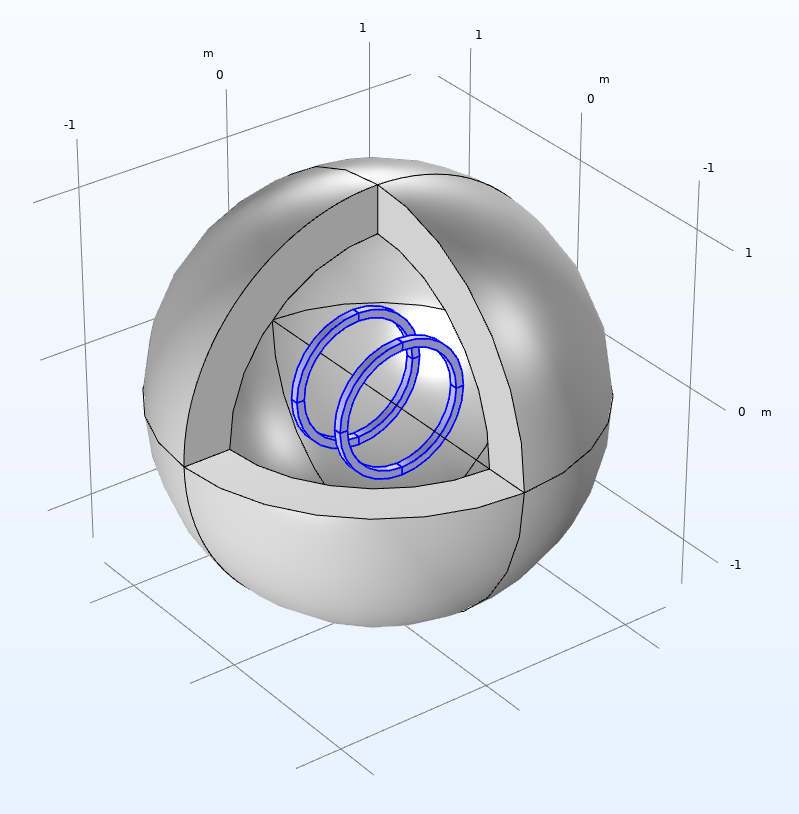
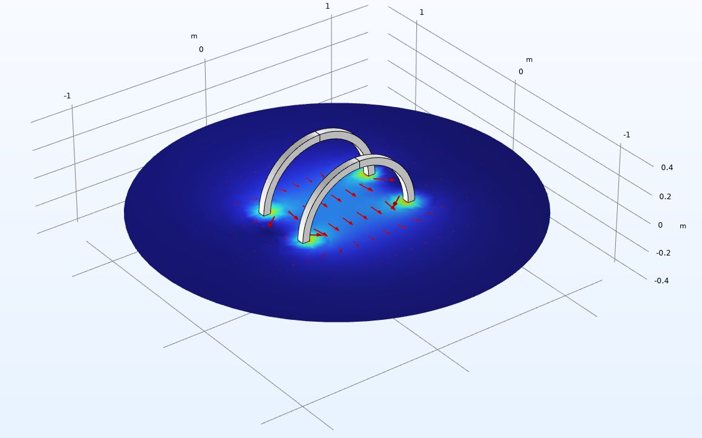

# COMSOL 学习案例记录

这是我的COMSOL学习练习案例集合，包含以下内容：

## 1. Helmholtz线圈磁场分析

Helmholtz线圈磁场分布模拟，包含线圈几何建模、磁场计算和可视化结果。展示了不同参数下的磁场均匀性分析。

 

## 2. 弹簧扣分析

弹簧扣的力学性能分析，包含应力应变分布、位移场和动画演示。附带中文技术文档说明。

## 3. 扳手应变分析

扳手在使用过程中的应力应变分析，展示了不同载荷条件下的变形情况和应力集中区域。

