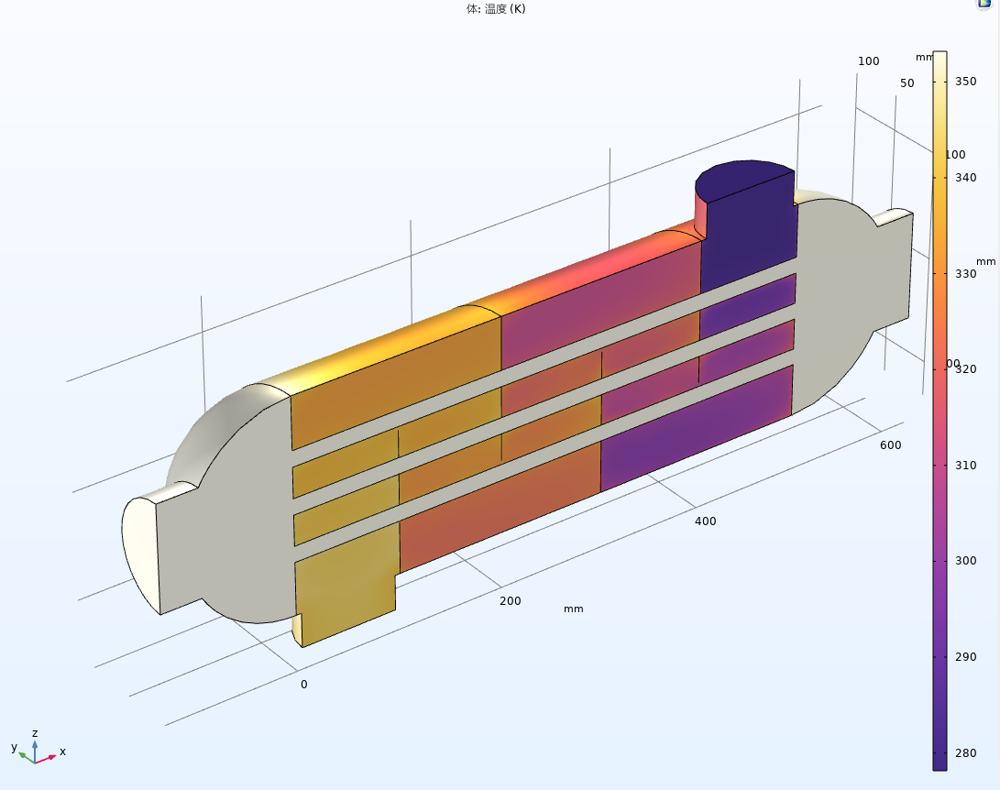
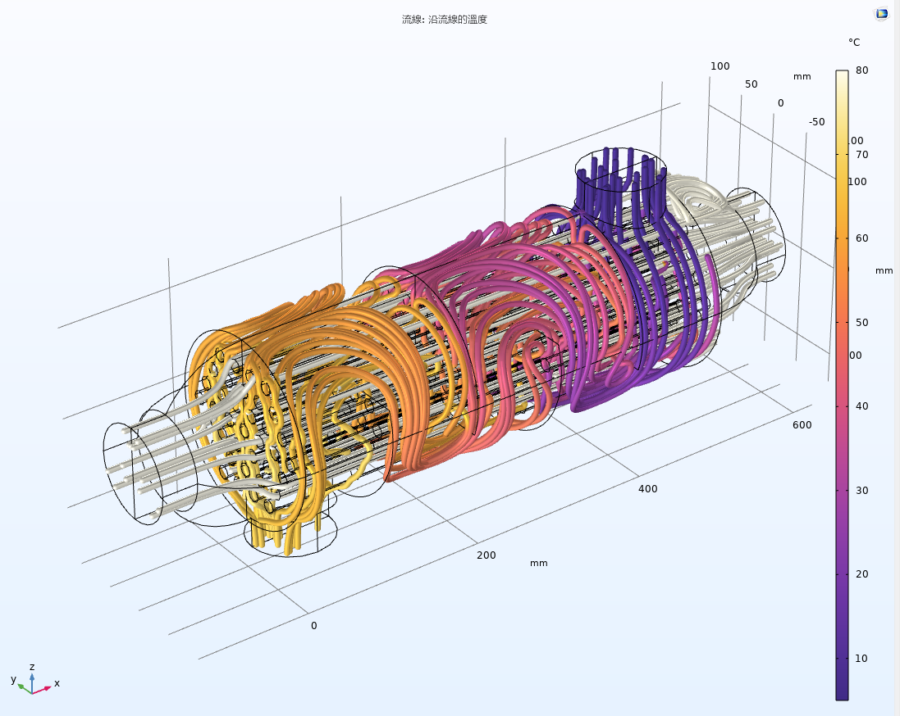
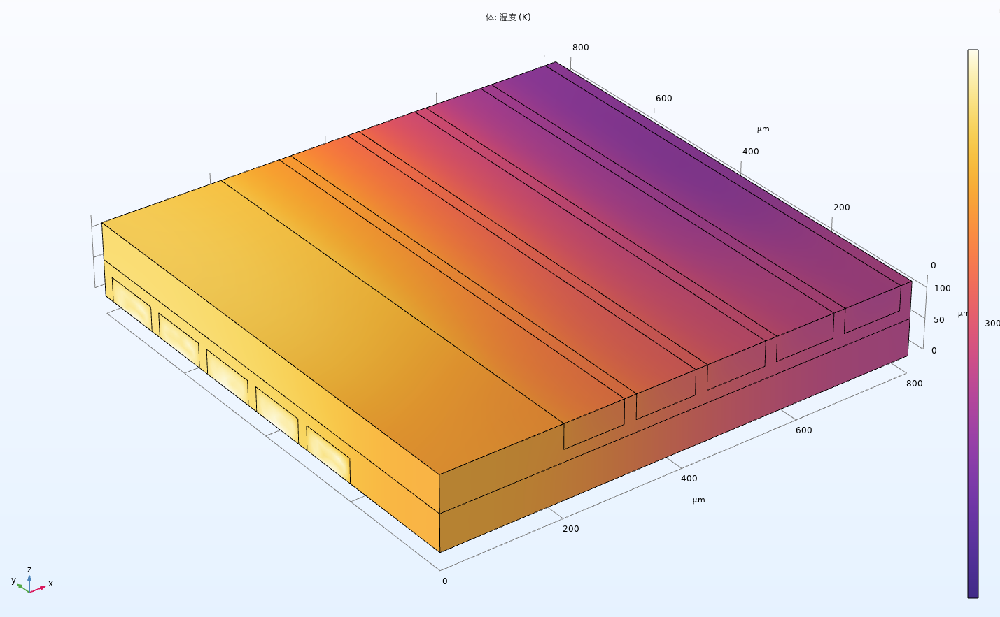
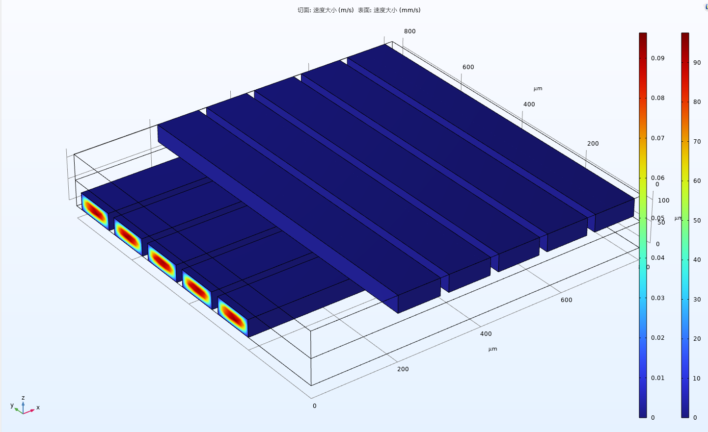

# COMSOL 学习案例记录

这是我的COMSOL学习练习案例集合，包含以下内容：

## 1. Helmholtz线圈磁场分析

Helmholtz线圈磁场分布模拟，包含线圈几何建模、磁场计算和可视化结果。展示了不同参数下的磁场均匀性分析。

 

## 2. 弹簧扣分析

弹簧扣的力学性能分析，包含应力应变分布、位移场和动画演示。附带中文技术文档说明。

## 3. 扳手应变分析

扳手在使用过程中的应力应变分析，展示了不同载荷条件下的变形情况和应力集中区域。

## 4. 电路散热分析

电路板散热器性能分析，包含温度分布、热流分析和表面力计算。

## 5. 管式换热器分析

壳管式换热器的热传递性能分析，包含温度场、压力分布和流速分析。

## 6. 散热器分析

散热器在不同工况下的温度分布和气流分析。

## 7. 碟片式散热器分析

碟片式散热器的热性能分析，包含接触温度分析和散热效果对比。

## 8. 交叉流换热分析

交叉流换热器的温度场和流速分析。

## 9. 压痕球黏附与剥离分析

压痕球的黏附与剥离过程模拟，包含2D和3D动画演示。

## 10. 微通道热流模型

微通道散热器的流动和温度场分析。

## 11. 压电传感器分析

压电传感器的位移场和电场分析。

## 12. 轴承不对中分析

轴承不对中情况下的力学性能分析，包含接触力、力矩和振动特性。

.png)

## 13. 电路板对流冷却

电路板对流冷却的温度场和流速分析。

## 14. 磁铁在铜管中下落

磁铁在铜管中下落的电磁感应现象分析，包含速度、加速度和电流密度分布。

## 15. 电磁柱塞分析

电磁柱塞的磁场分布和力学性能分析。

